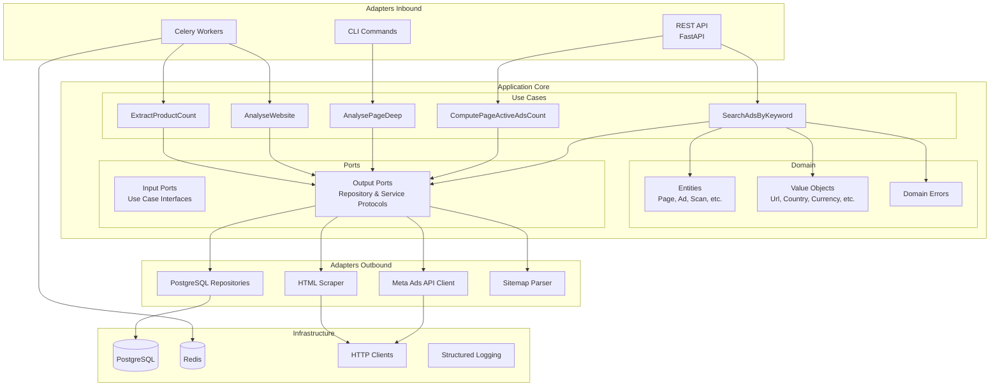

# ARCHITECTURE & ENGINEERING GUIDELINES — Dropshipping Platform

> **Version**: 2.0.0
> **Dernière mise à jour**: Sprint 2
> **Mainteneur**: Tech Lead / Architecte

---

## Table des matières

1. [Vision d'Architecture](#1-vision-darchitecture-hexagonale--clean)
2. [Principes fondamentaux](#2-principes-fondamentaux-non-négociables)
3. [Détails par couche](#3-détails-par-couche)
4. [Qualité & Testing](#4-qualité--testing)
5. [Conventions de code](#5-conventions-de-code)
6. [Structure du projet](#6-structure-du-projet)
7. [Process de Sprint & Workflow Dev](#7-process-de-sprint--workflow-dev)
8. [Architecture Decision Records (ADR)](#8-architecture-decision-records-adr)
9. [Changelog historique](#9-changelog-historique)

---

## 1. Vision d'Architecture (Hexagonale / Clean)

### 1.1 Philosophie

Le projet Dropshipping Platform suit une **Architecture Hexagonale** (aussi appelée Ports & Adapters), combinée aux principes de **Clean Architecture**.

L'objectif principal est de **protéger le domaine métier** de toute dépendance technique (frameworks, bases de données, APIs externes).

### 1.2 Schéma d'Architecture



### 1.3 Flux de dépendances

```
Inbound Adapters → Use Cases → Domain ← Ports ← Outbound Adapters
                                  ↑
                            (Dependency Inversion)
```

**Règle d'or** : Les dépendances pointent **toujours vers l'intérieur** (vers le domaine).

---

## 2. Principes fondamentaux (non négociables)

### 2.1 SOLID

| Principe | Application dans le projet |
|----------|---------------------------|
| **S**ingle Responsibility | Chaque Use Case = 1 responsabilité unique |
| **O**pen/Closed | Entities extensibles via composition, fermées à la modification |
| **L**iskov Substitution | Tous les adapters implémentent fidèlement leurs Ports |
| **I**nterface Segregation | Ports granulaires (PageRepository ≠ AdsRepository) |
| **D**ependency Inversion | Use Cases dépendent de Ports (abstractions), pas d'implémentations |

### 2.2 CRAFT Principles

- **Clean Code** : Code lisible, auto-documenté, sans commentaires superflus
- **Refactoring** : Amélioration continue sans changer le comportement
- **Attention aux détails** : Nommage précis, découpage cohérent
- **Fast Feedback** : Tests rapides, CI/CD, fail fast
- **Testing** : TDD encouraged, coverage minimum 85%

### 2.3 Règles non négociables

| Règle | Description |
|-------|-------------|
| **Domain-first** | Le domaine ne dépend de RIEN (aucun import externe) |
| **Typage strict** | 100% du code typé avec `mypy --strict` |
| **Async par défaut** | Toutes les I/O sont asynchrones |
| **Immutabilité** | Value Objects = `@dataclass(frozen=True)` |
| **Zéro framework dans le domaine** | Pas de SQLAlchemy, FastAPI, etc. dans `core/` |
| **Exceptions typées** | Hiérarchie d'erreurs métier, jamais `raise Exception` |
| **Logging structuré** | JSON logs avec contexte (correlation_id, etc.) |

---

## 3. Détails par couche

### 3.1 Domaine (`src/app/core/domain/`)

Le domaine contient la **logique métier pure**, indépendante de toute technologie.

#### 3.1.1 Entities

Les entités possèdent une **identité** et un **cycle de vie**.

```python
# Exemple : Page entity
@dataclass
class Page:
    id: str
    url: Url
    state: PageState
    # ... méthodes métier

    def transition_state(self, new_status: PageStatus) -> "Page":
        """Transition d'état avec validation."""
        new_state = self.state.transition_to(new_status)
        return Page(..., state=new_state)
```

**Entities actuelles** :
- `Page` — Représente une page Facebook/landing page
- `Ad` — Publicité Meta Ads
- `Scan` — Session de scan
- `KeywordRun` — Exécution de recherche par mot-clé
- `ShopifyProfile` — Profil e-commerce Shopify

#### 3.1.2 Value Objects

Les Value Objects sont **immutables** et comparés par **valeur**.

```python
@dataclass(frozen=True)  # OBLIGATOIRE
class Url:
    value: str

    def __post_init__(self) -> None:
        # Validation à la construction
        if not self.value.startswith(("http://", "https://")):
            raise InvalidUrlError(self.value)
```

**Value Objects actuels** :
- `Url` — URL validée (http/https)
- `Country` — Code pays ISO 3166-1 alpha-2
- `Language` — Code langue ISO 639-1
- `Currency` — Code devise ISO 4217
- `PaymentMethods` — Méthodes de paiement acceptées
- `ProductCount` — Nombre de produits (0-999999)
- `Category` — Catégorie de produit
- `PageState` — État avec machine à états
- `ScanId` — UUID v4 validé

#### 3.1.3 Domain Errors

Hiérarchie d'erreurs métier typées :

```python
class DomainError(Exception):
    """Erreur de base du domaine."""
    pass

class InvalidUrlError(DomainError): ...
class InvalidCountryCodeError(DomainError): ...
class InvalidStateTransitionError(DomainError): ...
# etc.
```

**Règle** : Ne jamais utiliser `except Exception`. Toujours cibler les exceptions spécifiques.

---

### 3.2 Ports (`src/app/core/ports/`)

Les Ports sont des **interfaces** (Protocol) définissant les contrats entre le domaine et le monde extérieur.

#### 3.2.1 Output Ports (Driven)

```python
class PageRepository(Protocol):
    """Port pour la persistence des Pages."""

    async def get_by_id(self, page_id: str) -> Page | None: ...
    async def save(self, page: Page) -> None: ...
    async def is_blacklisted(self, page_id: str) -> bool: ...
    async def blacklist(self, page_id: str) -> None: ...
```

**Ports actuels** :
- `PageRepository` — Persistence des Pages
- `AdsRepository` — Persistence des Ads
- `ScanRepository` — Persistence des Scans
- `KeywordRunRepository` — Persistence des KeywordRuns
- `MetaAdsPort` — Client API Meta Ads
- `HtmlScraperPort` — Scraping HTML
- `SitemapPort` — Parsing sitemaps
- `TaskDispatcherPort` — Dispatch de tâches async
- `LoggingPort` — Logging structuré

#### 3.2.2 Règles des Ports

- Utiliser `typing.Protocol` (pas ABC)
- Aucune implémentation, juste des signatures
- Méthodes `async` pour toute I/O
- Types de retour explicites (pas de `Any`)

---

### 3.3 Use Cases (`src/app/core/usecases/`)

Les Use Cases orchestrent la logique applicative **sans connaître les détails techniques**.

#### 3.3.1 Structure d'un Use Case

```python
class SearchAdsByKeywordUseCase:
    """Recherche des publicités par mot-clé."""

    def __init__(
        self,
        meta_ads: MetaAdsPort,
        page_repo: PageRepository,
        ads_repo: AdsRepository,
        logger: LoggingPort,
    ) -> None:
        self._meta_ads = meta_ads
        self._page_repo = page_repo
        self._ads_repo = ads_repo
        self._logger = logger

    async def execute(
        self,
        keyword: str,
        country: Country,
        limit: int = 100,
    ) -> SearchResult:
        # Orchestration uniquement
        ...
```

#### 3.3.2 Règles des Use Cases

| Règle | Explication |
|-------|-------------|
| Pas de DB | Utiliser les Repositories (Ports) |
| Pas de HTTP | Utiliser les Ports (MetaAdsPort, etc.) |
| Pas de scraping | Utiliser HtmlScraperPort |
| Orchestration only | Appeler les Ports, transformer les données |
| Erreurs métier | Lever des DomainError, pas des exceptions techniques |

#### 3.3.3 Use Cases actuels

| Use Case | Responsabilité |
|----------|----------------|
| `SearchAdsByKeywordUseCase` | Recherche d'ads via Meta Ads API |
| `ComputePageActiveAdsCountUseCase` | Calcul du nombre d'ads actives |
| `AnalysePageDeepUseCase` | Analyse approfondie d'une page |
| `AnalyseWebsiteUseCase` | Détection Shopify, extraction profil |
| `ExtractProductCountUseCase` | Comptage produits via sitemap |

---

### 3.4 Adapters Outbound (`src/app/adapters/outbound/`)

Implémentations concrètes des Output Ports.

#### 3.4.1 À implémenter (Sprint 1+)

| Adapter | Port implémenté | Technologie |
|---------|-----------------|-------------|
| `PostgresPageRepository` | `PageRepository` | SQLAlchemy async |
| `PostgresAdsRepository` | `AdsRepository` | SQLAlchemy async |
| `MetaAdsClient` | `MetaAdsPort` | httpx + Meta Graph API |
| `PlaywrightScraper` | `HtmlScraperPort` | Playwright async |
| `SitemapParser` | `SitemapPort` | httpx + lxml |
| `StructlogLogger` | `LoggingPort` | structlog |

#### 3.4.2 Règles des Adapters Outbound

- Implémentent exactement l'interface du Port
- Gèrent les erreurs techniques et les convertissent en erreurs domaine
- Responsables du mapping DB ↔ Entity

---

### 3.5 Adapters Inbound (`src/app/adapters/inbound/`)

Points d'entrée de l'application.

#### 3.5.1 À implémenter (Sprint 2+)

| Adapter | Technologie | Responsabilité |
|---------|-------------|----------------|
| REST API | FastAPI | Endpoints HTTP |
| CLI | Click/Typer | Commandes terminal |
| Celery Tasks | Celery | Workers async |

#### 3.5.2 Règles des Adapters Inbound

- Validation des inputs (Pydantic)
- Conversion DTO → Domain objects
- Appel du Use Case approprié
- Conversion Domain objects → Response DTO
- Gestion des erreurs HTTP (4xx, 5xx)

---

### 3.6 Infrastructure (`src/app/infrastructure/`)

Configuration et clients techniques partagés.

#### 3.6.1 Modules

| Module | Responsabilité |
|--------|----------------|
| `db/` | Configuration SQLAlchemy, migrations Alembic |
| `http/` | Client HTTP partagé (httpx) |
| `logging/` | Configuration structlog |
| `celery/` | Configuration Celery + Redis |
| `settings/` | Pydantic Settings (env vars) |

#### 3.6.2 Règle clé

L'infrastructure **ne contient pas de logique métier**. Elle fournit des outils techniques aux Adapters.

---

## 4. Qualité & Testing

### 4.1 Stratégie de tests

```
┌─────────────────────────────────────────────────────────┐
│                    Tests E2E (5%)                       │
│              Scénarios utilisateur complets             │
├─────────────────────────────────────────────────────────┤
│              Tests d'Intégration (15%)                  │
│         Adapters + DB réelle + VCR.py                   │
├─────────────────────────────────────────────────────────┤
│              Tests Unitaires (80%)                      │
│    Domain + Use Cases avec Fakes/Mocks                  │
└─────────────────────────────────────────────────────────┘
```

### 4.2 Exigences

| Métrique | Seuil | Outil |
|----------|-------|-------|
| Couverture globale | ≥ 85% | pytest-cov |
| Couverture domaine | 100% | pytest-cov |
| Couverture use cases | 100% | pytest-cov |
| Typage | 0 erreurs | mypy --strict |
| Linting | 0 erreurs | ruff |
| Formatage | Automatique | black + isort |

### 4.3 Structure des tests

```
tests/
├── conftest.py          # Fixtures globales + Fakes
├── domain/
│   ├── test_entities.py
│   └── test_value_objects.py
├── usecases/
│   ├── test_search_ads_by_keyword.py
│   ├── test_compute_page_active_ads_count.py
│   ├── test_analyse_page_deep.py
│   ├── test_analyse_website.py
│   └── test_extract_product_count.py
├── adapters/
│   ├── outbound/
│   │   └── test_postgres_repositories.py
│   └── inbound/
│       └── test_api_endpoints.py
└── integration/
    └── test_full_scan_flow.py
```

### 4.4 Conventions de test

```python
class TestSearchAdsByKeywordUseCase:
    """Tests pour SearchAdsByKeywordUseCase."""

    async def test_search_ads_happy_path(self, ...):
        """Recherche réussie retourne les ads filtrées."""
        # Arrange
        ...
        # Act
        result = await use_case.execute(...)
        # Assert
        assert result.ads_count == 5

    async def test_search_ads_empty_keyword_raises_error(self, ...):
        """Mot-clé vide lève InvalidKeywordError."""
        with pytest.raises(InvalidKeywordError):
            await use_case.execute(keyword="")
```

### 4.5 Fakes vs Mocks

| Type | Usage | Exemple |
|------|-------|---------|
| **Fake** | Implémentation simplifiée in-memory | `FakePageRepository` |
| **Mock** | Vérification d'appels | `AsyncMock` pour API externes |

**Préférer les Fakes** pour les repositories (comportement plus réaliste).

---

## 5. Conventions de code

### 5.1 Nommage

| Élément | Convention | Exemple |
|---------|------------|---------|
| Modules | snake_case | `page_repository.py` |
| Classes | PascalCase | `SearchAdsByKeywordUseCase` |
| Fonctions/Méthodes | snake_case | `get_by_id()` |
| Constantes | SCREAMING_SNAKE | `MAX_RETRY_COUNT` |
| Variables privées | _underscore prefix | `self._logger` |
| Protocoles | Suffixe `Port` ou `Repository` | `MetaAdsPort` |

### 5.2 Imports

```python
# 1. Standard library
from dataclasses import dataclass
from datetime import datetime
from typing import Protocol

# 2. Third-party (si nécessaire dans adapters)
import httpx
from sqlalchemy import select

# 3. Local imports (absolus)
from src.app.core.domain.entities.page import Page
from src.app.core.domain.errors import InvalidUrlError
```

**Règle** : Imports absolus uniquement, pas de `from . import`.

### 5.3 Découpage des fichiers

| Règle | Limite |
|-------|--------|
| Lignes par fichier | ≤ 400 |
| Lignes par fonction | ≤ 50 |
| Paramètres par fonction | ≤ 5 |
| Niveaux d'indentation | ≤ 4 |

### 5.4 Gestion des exceptions

```python
# ❌ INTERDIT
try:
    result = await self._meta_ads.search(keyword)
except Exception as e:
    self._logger.error("Failed", error=e)

# ✅ CORRECT
try:
    result = await self._meta_ads.search(keyword)
except (KeyError, TypeError, AttributeError) as exc:
    self._logger.warning(
        "Failed to convert raw ad to domain entity",
        raw_ad_id=raw.get("id"),
        error=str(exc),
    )
    return None
except MetaAdsApiError as exc:
    self._logger.error("Meta Ads API failed", error=str(exc))
    raise
```

### 5.5 Logging structuré

```python
# Format attendu
self._logger.info(
    "Scan completed",
    scan_id=scan.id,
    pages_found=result.pages_count,
    duration_ms=duration,
)

# Niveaux appropriés
# DEBUG : Détails techniques (développement)
# INFO  : Événements métier normaux
# WARNING : Situations anormales mais gérées
# ERROR : Erreurs nécessitant attention
```

---

## 6. Structure du projet

### 6.1 Arborescence actuelle (Sprint 0.1)

```
DropshippingPlatform/
├── ARCHITECTURE.md              # Ce fichier
├── pyproject.toml               # Configuration projet
├── requirements-dev.txt         # Dépendances dev
├── .gitignore
│
├── src/
│   └── app/
│       ├── __init__.py
│       ├── main.py              # Point d'entrée
│       │
│       ├── core/                # 🎯 DOMAINE (protégé)
│       │   ├── __init__.py
│       │   │
│       │   ├── domain/
│       │   │   ├── __init__.py
│       │   │   ├── errors.py
│       │   │   │
│       │   │   ├── entities/
│       │   │   │   ├── __init__.py
│       │   │   │   ├── ad.py
│       │   │   │   ├── keyword_run.py
│       │   │   │   ├── page.py
│       │   │   │   ├── scan.py
│       │   │   │   └── shopify_profile.py
│       │   │   │
│       │   │   └── value_objects/
│       │   │       ├── __init__.py
│       │   │       ├── category.py
│       │   │       ├── country.py
│       │   │       ├── currency.py
│       │   │       ├── language.py
│       │   │       ├── page_state.py
│       │   │       ├── payment_methods.py
│       │   │       ├── product_count.py
│       │   │       ├── scan_id.py
│       │   │       └── url.py
│       │   │
│       │   ├── ports/
│       │   │   ├── __init__.py
│       │   │   ├── html_scraper_port.py
│       │   │   ├── logging_port.py
│       │   │   ├── meta_ads_port.py
│       │   │   ├── repository_port.py
│       │   │   ├── sitemap_port.py
│       │   │   └── task_dispatcher_port.py
│       │   │
│       │   └── usecases/
│       │       ├── __init__.py
│       │       ├── analyse_page_deep.py
│       │       ├── analyse_website.py
│       │       ├── compute_page_active_ads_count.py
│       │       ├── extract_product_count.py
│       │       └── search_ads_by_keyword.py
│       │
│       ├── adapters/            # 🔌 ADAPTERS (à implémenter)
│       │   ├── __init__.py
│       │   ├── inbound/
│       │   │   └── __init__.py
│       │   └── outbound/
│       │       └── __init__.py
│       │
│       └── infrastructure/      # ⚙️ INFRA (à implémenter)
│           ├── __init__.py
│           ├── celery/
│           │   └── __init__.py
│           ├── db/
│           │   └── __init__.py
│           ├── http/
│           │   └── __init__.py
│           ├── logging/
│           │   └── __init__.py
│           └── settings/
│               └── __init__.py
│
└── tests/
    ├── __init__.py
    ├── conftest.py              # Fixtures + Fakes
    │
    ├── domain/
    │   ├── __init__.py
    │   ├── test_entities.py
    │   └── test_value_objects.py
    │
    └── usecases/
        ├── __init__.py
        ├── test_analyse_page_deep.py
        ├── test_analyse_website.py
        ├── test_compute_page_active_ads_count.py
        ├── test_extract_product_count.py
        └── test_search_ads_by_keyword.py
```

### 6.2 Structure cible (Sprint 2+)

```
src/app/
├── adapters/
│   ├── inbound/
│   │   ├── api/
│   │   │   ├── routes/
│   │   │   ├── schemas/
│   │   │   └── dependencies.py
│   │   └── cli/
│   │       └── commands/
│   │
│   └── outbound/
│       ├── repositories/
│       │   ├── postgres_page_repository.py
│       │   └── postgres_ads_repository.py
│       ├── clients/
│       │   ├── meta_ads_client.py
│       │   └── playwright_scraper.py
│       └── parsers/
│           └── sitemap_parser.py
│
└── infrastructure/
    ├── db/
    │   ├── models/
    │   ├── migrations/
    │   └── session.py
    ├── http/
    │   └── client.py
    ├── logging/
    │   └── structlog_config.py
    ├── celery/
    │   ├── app.py
    │   └── tasks/
    └── settings/
        └── config.py
```

---

## 7. Process de Sprint & Workflow Dev

### 7.1 Cycle de développement

```
┌─────────────────────────────────────────────────────────────┐
│  1. SPEC       │  Tech Lead définit les exigences          │
├─────────────────────────────────────────────────────────────┤
│  2. DESIGN     │  Architecture + découpage en tâches       │
├─────────────────────────────────────────────────────────────┤
│  3. IMPLEMENT  │  Développement sur branche feature        │
├─────────────────────────────────────────────────────────────┤
│  4. TEST       │  Tests unitaires + intégration            │
├─────────────────────────────────────────────────────────────┤
│  5. REVIEW     │  PR + Code Review                         │
├─────────────────────────────────────────────────────────────┤
│  6. MERGE      │  Merge vers main après validation         │
└─────────────────────────────────────────────────────────────┘
```

### 7.2 Conventions de commit

Format **Conventional Commits** :

```
<type>(<scope>): <description>

[optional body]

[optional footer]
```

| Type | Usage |
|------|-------|
| `feat` | Nouvelle fonctionnalité |
| `fix` | Correction de bug |
| `refactor` | Refactoring sans changement de comportement |
| `test` | Ajout/modification de tests |
| `docs` | Documentation |
| `chore` | Maintenance, config, etc. |

**Exemples** :
```
feat(domain): add PageState value object with state machine
fix(usecases): handle empty keyword in search
chore(sprint-0.1): domain hardening and tests fixes
docs: add ARCHITECTURE.md (initial version)
```

### 7.3 Règles de branche

| Branche | Usage |
|---------|-------|
| `main` | Production-ready, protégée |
| `develop` | Intégration continue |
| `feature/<name>` | Développement feature |
| `fix/<name>` | Correction bug |
| `claude/<task-id>` | Branches Claude Code |

### 7.4 Pull Request Guidelines

- **Titre** : Conventional commit format
- **Description** : Contexte, changements, tests
- **Checklist** :
  - [ ] Tests passent localement
  - [ ] Coverage ≥ 85%
  - [ ] Pas d'erreurs mypy
  - [ ] Code formaté (black/ruff)
  - [ ] ARCHITECTURE.md mis à jour si nécessaire

---

## 8. Architecture Decision Records (ADR)

### ADR-001: Architecture Hexagonale

| | |
|---|---|
| **Date** | 2024-XX-XX (Sprint 0) |
| **Statut** | Accepté |
| **Contexte** | Besoin d'une architecture maintenable, testable, évolutive |
| **Décision** | Adopter l'Architecture Hexagonale (Ports & Adapters) |
| **Conséquences** | + Domaine protégé, + Testabilité, - Complexité initiale |

### ADR-002: Python avec typage strict

| | |
|---|---|
| **Date** | 2024-XX-XX (Sprint 0) |
| **Statut** | Accepté |
| **Contexte** | Garantir la qualité du code et faciliter la maintenance |
| **Décision** | Typage strict obligatoire (`mypy --strict`) |
| **Conséquences** | + Détection erreurs précoce, + Documentation implicite, - Verbosité |

### ADR-003: Value Objects immutables

| | |
|---|---|
| **Date** | 2024-XX-XX (Sprint 0) |
| **Statut** | Accepté |
| **Contexte** | Garantir l'intégrité des données du domaine |
| **Décision** | Tous les Value Objects utilisent `@dataclass(frozen=True)` |
| **Conséquences** | + Thread-safe, + Hashable, - Création d'objets pour chaque modification |

### ADR-004: Async par défaut

| | |
|---|---|
| **Date** | 2024-XX-XX (Sprint 0) |
| **Statut** | Accepté |
| **Contexte** | Application I/O-bound (API Meta, scraping, DB) |
| **Décision** | Toutes les opérations I/O sont asynchrones |
| **Conséquences** | + Performance, + Scalabilité, - Complexité debugging |

### ADR-005: Exceptions typées vs codes d'erreur

| | |
|---|---|
| **Date** | 2024-XX-XX (Sprint 0.1) |
| **Statut** | Accepté |
| **Contexte** | Gestion cohérente des erreurs métier |
| **Décision** | Hiérarchie d'exceptions typées, jamais `except Exception` |
| **Conséquences** | + Traçabilité, + Gestion fine, - Verbosité catch |

---

## 9. Changelog historique

### Sprint 0 — Foundation (Initial)

**Objectif** : Mettre en place les fondations du projet

**Livrables** :
- [x] Structure de dossiers hexagonale
- [x] Domain layer complet
  - 5 Entities : Page, Ad, Scan, KeywordRun, ShopifyProfile
  - 9 Value Objects : Url, Country, Language, Currency, PaymentMethods, ProductCount, Category, PageState, ScanId
  - Hiérarchie d'erreurs (DomainError + 15 exceptions typées)
- [x] Ports layer complet
  - 4 Repositories : Page, Ads, Scan, KeywordRun
  - 4 Services : MetaAds, HtmlScraper, Sitemap, TaskDispatcher
  - 1 Cross-cutting : Logging
- [x] Use Cases layer complet
  - SearchAdsByKeywordUseCase
  - ComputePageActiveAdsCountUseCase
  - AnalysePageDeepUseCase
  - AnalyseWebsiteUseCase
  - ExtractProductCountUseCase
- [x] Tests unitaires (168 tests)
- [x] Configuration pytest + coverage

**Commits** :
- `feat(sprint-0): add domain entities`
- `feat(sprint-0): add domain value objects`
- `feat(sprint-0): add domain ports (interfaces)`
- `feat(sprint-0): add domain use cases`
- `feat(sprint-0): add tests for domain and usecases`

---

### Sprint 0.1 — Corrections & Hardening

**Objectif** : Consolider et corriger le code du Sprint 0

**Livrables** :
- [x] Vérification PageState (déjà correct avec `@dataclass(frozen=True)`)
- [x] Fix FakePageRepository : renommage `self.blacklist` → `self._blacklisted_pages`
- [x] Remplacement `except Exception` par exceptions ciblées
- [x] Ajout logging structuré pour les erreurs de conversion
- [x] Validation couverture : **89.97%** (seuil: 85%)
- [x] Ajout `.gitignore` pour artefacts Python

**Commits** :
- `chore(sprint-0.1): domain hardening and tests fixes`
- `chore: add .gitignore for Python build artifacts`

---

### Sprint 1 — Infrastructure & Adapters

**Objectif** : Implémenter les adapters outbound et l'infrastructure SaaS-ready

**Livrables** :

#### Étape 1 — Database Infrastructure
- [x] SQLAlchemy 2.0 async configuration (`infrastructure/db/database.py`)
- [x] ORM Models : PageModel, AdModel, ScanModel, KeywordRunModel, BlacklistedPageModel
- [x] Configuration via `.env.example`

#### Étape 2 — Domain ↔ ORM Mappers
- [x] Bidirectional mappers (pure functions, no I/O)
- [x] Full Value Object handling
- [x] `page_mapper.py`, `ad_mapper.py`, `scan_mapper.py`, `keyword_run_mapper.py`

#### Étape 3 — SQLAlchemy Repositories
- [x] `PostgresPageRepository` implementing `PageRepository` port
- [x] `PostgresAdsRepository` implementing `AdsRepository` port
- [x] `PostgresScanRepository` implementing `ScanRepository` port
- [x] `PostgresKeywordRunRepository` implementing `KeywordRunRepository` port

#### Étape 4 — Meta Ads Client
- [x] `MetaAdsClient` implementing `MetaAdsPort`
- [x] aiohttp + Tenacity for retry with exponential backoff
- [x] Pagination, rate limiting, error conversion to domain errors

#### Étape 5 — HTTP Clients (HTML Scraper + Sitemap)
- [x] `BaseHttpClient` for shared HTTP logic (retry, headers, errors)
- [x] `HtmlScraperClient` implementing `HtmlScraperPort` (aiohttp + BeautifulSoup)
- [x] `SitemapClient` implementing `SitemapPort` (aiohttp + lxml)
- [x] NO Playwright — lightweight aiohttp approach

#### Étape 6 — Full SaaS Infrastructure
- [x] Docker Compose (postgres, app, mockserver services)
- [x] Multi-stage Dockerfile (builder → development → production)
- [x] Alembic async migrations with initial schema
- [x] Pydantic v2 Settings (`runtime_settings.py`)
- [x] GitHub Actions CI (lint, unit tests, integration tests)
- [x] Makefile with dev workflow commands
- [x] Integration tests for all adapters
- [x] Flask mock server for testing

#### Corrections Finales
- [x] FastAPI minimal stub in `main.py` with `/health` endpoint
- [x] `pyproject.toml` with runtime + dev dependencies (uv compatible)

**Commits** :
- `feat(sprint-1): add database infrastructure and ORM models`
- `feat(sprint-1): add ORM ↔ domain mappers`
- `feat(sprint-1): implement SQLAlchemy repositories`
- `feat(sprint-1): implement Meta Ads client adapter`
- `feat(sprint-1): add HTML scraper and Sitemap HTTP clients`
- `feat(sprint-1): add infrastructure runtime, migrations, CI/CD and integration tests`
- `chore(sprint-1): fix FastAPI entrypoint, add dependencies, update docs`

---

### Sprint 2 — Application Layer & Task System

**Objectif** : Implémenter les adapters inbound (API FastAPI, Celery workers, admin monitoring)

**Livrables** :

#### Étape 1 — FastAPI Application Layer
- [x] FastAPI application with lifespan handler (`main.py`)
- [x] Shared HTTP session via `app.state` in lifespan context
- [x] API routes structure (`src/app/api/routers/`)
  - Health endpoint: `GET /health`
  - Keywords: `POST /api/v1/keywords/search`
  - Pages: `GET /api/v1/pages`, `GET /api/v1/pages/{page_id}`
  - Scans: `GET /api/v1/scans/{scan_id}`
- [x] Pydantic schemas (`src/app/api/schemas/`)
- [x] Dependency injection (`src/app/api/dependencies.py`)
- [x] Exception handlers with HTTP status mapping:
  - `EntityNotFoundError` → 404
  - `MetaAdsRateLimitError` → 429
  - `MetaAdsAuthenticationError` → 401
  - `ScrapingBlockedError` → 403
  - `ScrapingTimeoutError` → 504
  - `SitemapNotFoundError` → 404
  - `SitemapParsingError` → 422
  - `RepositoryError` → 500
  - `TaskDispatchError` → 503
- [x] Integration tests for API endpoints (21 tests)

#### Étape 2 — TaskDispatcherPort (Celery + Redis)
- [x] Redis + Celery Worker services in `docker-compose.yml`
- [x] `CelerySettings` configuration in `runtime_settings.py`
- [x] Celery application (`src/app/infrastructure/celery/celery_app.py`)
- [x] Task definitions (`src/app/infrastructure/celery/tasks.py`):
  - `scan_page_task`
  - `analyse_website_task`
  - `count_sitemap_products_task`
- [x] `CeleryTaskDispatcher` adapter implementing `TaskDispatcherPort`
- [x] DI integration with `get_task_dispatcher()` and `TaskDispatcher` type alias
- [x] Unit tests for CeleryTaskDispatcher (12 tests)

#### Étape 3 — Admin Monitoring Endpoints
- [x] Admin router (`src/app/api/routers/admin.py`):
  - `GET /api/v1/admin/pages/active` — List pages with filters (country, is_shopify, min_ads, max_ads, state)
  - `GET /api/v1/admin/keywords/recent` — List recent keyword runs
  - `GET /api/v1/admin/scans` — List scans with filters (status, since, page_id)
- [x] Admin schemas (`src/app/api/schemas/admin.py`)
- [x] `list_scans` method added to `PostgresScanRepository`
- [x] Integration tests for admin endpoints (12 tests)

#### Testing
- [x] Fixed pytest-asyncio scope issues in integration tests
- [x] 213 unit tests passing (excluding DB integration tests requiring PostgreSQL)
- [x] DB integration tests properly marked with `@pytest.mark.integration`

**Flux d'architecture** :
```
Client HTTP → FastAPI Router → Use Cases → Ports → Adapters → DB / External APIs
                    ↓
              TaskDispatcher → Celery → Redis → Worker Tasks
```

**Commits** :
- `feat(sprint-2): add FastAPI application layer and basic endpoints`
- `fix(api): improve HTTP session management and exception handlers`
- `feat(sprint-2): add Celery-based task dispatcher and worker infrastructure`
- `chore(sprint-2): add admin monitoring endpoints, fix integration tests and update documentation`

---

### Sprint 2.1 — Hardening & Cleanup

**Objectif** : Durcissement et nettoyage avant Sprint 3 - pas de nouvelles features, uniquement robustesse & propreté.

**Livrables** :

#### Étape 1 — Celery Tasks connectées aux Use Cases (P0)
- [x] Création de `WorkerContainer` (`infrastructure/celery/container.py`)
  - Construction des dépendances (DB sessions, HTTP clients, repos)
  - Injection des Use Cases dans les workers
- [x] Remplacement des placeholders dans les tasks :
  - `scan_page_task` → `AnalysePageDeepUseCase`
  - `analyse_website_task` → `AnalyseWebsiteUseCase`
  - `count_sitemap_products_task` → `ExtractProductCountUseCase`
- [x] Conversion paramètres string → Value Objects (Country, ScanId, Url)
- [x] Gestion des erreurs avec logging structuré

#### Étape 2 — LoggingPort Adapter (P1)
- [x] Création de `StandardLoggingAdapter` (`infrastructure/logging/logger_adapter.py`)
  - Implémente `LoggingPort` via `logging.Logger`
  - Support du contexte structuré via `extra`
- [x] Configuration globale du logging (`infrastructure/logging/config.py`)
  - Niveau par défaut INFO
  - Format timestamp | level | name | message
  - Réduction du bruit des libs tierces
- [x] Remplacement de `SimpleLogger` dans `dependencies.py`
- [x] Suppression des `print()` dans `main.py`

#### Étape 3 — Simplification DI (P2)
- [x] Refactoring des factories de Use Cases pour utiliser les dépendances injectées
  - `get_search_ads_use_case(page_repo: PageRepo, keyword_run_repo: KeywordRunRepo, ...)`
  - Plus de ré-instanciation de repositories
- [x] Loggers nommés par use case (`usecase.search_ads`, etc.)
- [x] Code plus explicite et testable

#### Étape 4 — Documentation AsyncTask (P2)
- [x] Documentation du pattern dans `tasks.py` (docstrings détaillées)
- [x] Explication des trade-offs :
  - Simplicité vs overhead (nouveau loop par tâche)
  - Isolation entre tâches
  - Acceptable pour la charge actuelle
- [x] TODO documenté pour évolution future (arq, pool event loop)

#### Étape 5 — Admin API Security (P2/P3)
- [x] `SecuritySettings` dans `runtime_settings.py`
  - `SECURITY_ADMIN_API_KEY` pour authentification
- [x] Dépendance `get_admin_auth` dans `dependencies.py`
  - Validation header `X-Admin-Api-Key`
  - Mode développement si pas de clé configurée
- [x] Protection de toutes les routes admin via `dependencies=[Depends(get_admin_auth)]`
- [x] Tests d'intégration pour 401 sans/mauvaise clé, 200 avec bonne clé

#### Architecture Decision: AsyncTask Event Loop Pattern

| | |
|---|---|
| **Decision** | Créer un nouveau event loop par tâche Celery |
| **Contexte** | Celery workers sync, use cases async |
| **Trade-offs** | + Simplicité, + Isolation, - Overhead (acceptable) |
| **Alternative future** | arq worker async natif si volumétrie explose |

**Tests** :
- Tests unitaires logging adapter (10 tests)
- Tests unitaires admin auth (5 tests)
- Tests d'intégration admin auth (6 tests)
- Tests Celery tasks mockés (structure en place)

**Commits** :
- `chore(sprint-2.1): harden task system, logging, DI and admin security`

---

### Sprint 3 — (À venir)

**Objectif** : UI/Dashboard, filtres avancés, observabilité

**Planification** :
- [ ] Admin Dashboard (front-end minimal ou API-driven)
- [ ] Filtres avancés + scoring des shops
- [ ] Observabilité (metrics Prometheus, tracing OpenTelemetry)
- [ ] E2E tests complets

**Note** : Sécurité admin (API keys) a été traitée en Sprint 2.1.

---

> **Note** : Ce document doit être mis à jour à la fin de chaque sprint.
> Ne jamais effacer l'historique, toujours ajouter.
